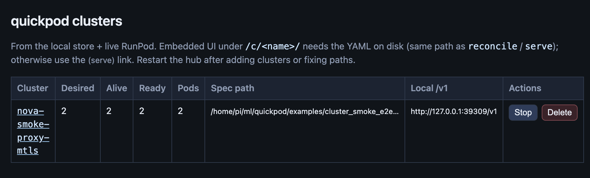
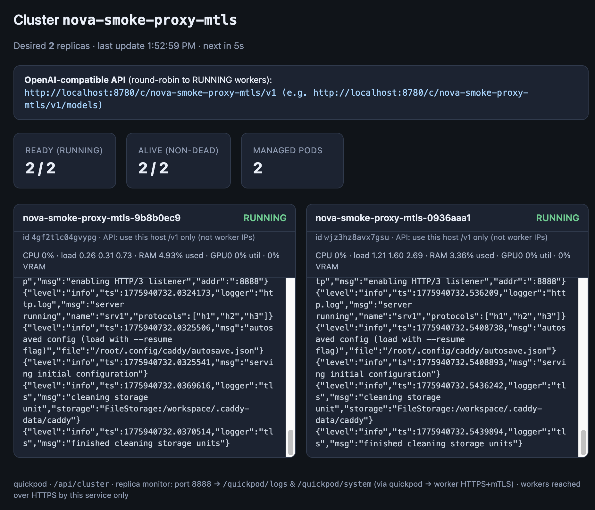

# Quickpod

## Context
Quickpod is a project to launch and manage GPUs in runpod, so I can experiment with cheap GPUs (4090/5090), and occasionally try H100 in the cloud for quick inference testing/learning.

I started with vast.ai as that is the cheapest offering I can find but its serverless offering is quite challenging to use, and all I want to just launch a vllm endpoint serving gemma 4 models, it took me hours to figure out. runpod is similar, it is just so hard to get serverless right. 

Then I looked into skypilot which is pretty neat. But it is a bit overkill, and doesn't provide something like load balancing/mTLS as first class. So I spent sometime vibe coding a simple remote GPU control plane. You will find some of the APIs similar to skypilot.






Basic functionalities:
- *Simple YAML interface to define the cluster*. Like # of nodes, the ports exposed to your client. How to set up the env, what command to run after the setup is done.
- *Naive load balancing*. A local quickpod service to provide a stable interface to remote GPU hosts. The local quickpod service will route request to the GPU hosts in the cluster in a round robin manner. (Optional) You can configure mTLS between local service and the remote GPU hosts to have better security.
- *Naive disaster recovery*. It will reconcile the cluster to the defined spec.
- *Scaling*. You can **manually** scale up and down the cluster.
- *Simple UI*. A very simple UI to manage the cluster (stop/delete) and see the logs.


See **`examples/`** for small smoke specs and **`recipes/`** for fuller workloads (e.g. vLLM + Gemma). `examples/cluster_smoke_e2e_mtls.yaml` is a good minimal mTLS walkthrough below.

## Install

Use [uv](https://docs.astral.sh/uv/):

```bash
cd quickpod
uv sync
```

Run the CLI with `uv run quickpod …` (or activate `.venv`).

Set `RUNPOD_API_KEY` in the environment, or copy `.env.example` to `.env` in the repo root (gitignored).

---

## Get Started 

This story walks through the **HTTPS + mTLS** smoke example: a tiny Python server on the worker (mock `/v1/models`), Caddy in front, and quickpod talking to workers with client TLS. `(examples/cluster_smoke_e2e_mtls.yaml)`

### What you will do

1. Generate dev certificates once.
2. Start `quickpod serve` with the spec so RunPod launches pods and your laptop runs the proxy + UI.
3. Open the dashboard and call `/v1/models` through quickpod.
4. Optionally use the multi-cluster hub, refresh after YAML edits, then remove the cluster when finished.

### 1. Generate certificates

From the repo root:

```bash
./scripts/gen_mtls_certs.sh examples/mtls_smoke_certs
```

The YAML references these paths under `resources.mtls`.

### 2. (Optional) Pick a GPU and see catalog pricing

```bash
uv run quickpod list-gpus
```

Use `resourcesGpu` as a hint for `resources.gpu` in your spec. Capacity varies by zone—edit `resources.zones` or retry later if deploy fails.

### 3. Start reconcile + local proxy + UI

```bash
uv run quickpod serve --spec examples/cluster_smoke_e2e_mtls.yaml
```

By default this runs **one reconcile** (register cluster, launch pods), then starts a **background daemon** with a random HTTP port. The command prints:

- **OpenAI base URL** — e.g. `http://127.0.0.1:<port>/v1`  
- **Cluster UI** — same origin as that base URL

Use `--port 8765` for a fixed port, or `--foreground` to stream logs in the terminal.

### 4. Use the dashboard

In a browser, open `http://127.0.0.1:<port>/` (or your machine’s LAN IP if you bound `0.0.0.0`). You should see desired vs alive replicas and **log tails** (newest lines at the bottom). Logs come from `/quickpod-log` on the worker (HTTPS to Caddy in this spec).

### 5. Call the OpenAI-compatible API

```bash
curl -sS "http://127.0.0.1:<port>/v1/models"
```

For OpenAI SDK clients, set:

`OPENAI_BASE_URL=http://127.0.0.1:<port>/v1`

Traffic goes **quickpod → worker** (mTLS to the pod); you do not call RunPod worker IPs directly for `/v1`.

### 6. Multi-cluster hub (optional)

In another terminal:

```bash
uv run quickpod ui
```

Open `http://127.0.0.1:8780/` to list clusters, **Stop** / **Delete**, or follow **embedded** links to `/c/<cluster>/` when the spec file is on disk. If a name is a prefix of another (e.g. `foo` vs `foo-mtls`), restart the hub after upgrades so mounts stay correct. Clusters without an embeddable spec show a **(serve)** link to the direct `quickpod serve` URL instead.

### 7. Edit the YAML and refresh

After changing the spec file, restart serve with the same options:

```bash
uv run quickpod refresh nova-smoke-proxy-mtls
```

(Use the cluster `name` from the YAML.) This stops RunPod pods and the local proxy for that name, then starts `serve` again from the saved path and listen settings.

### 8. Tear down

```bash
uv run quickpod clusters remove nova-smoke-proxy-mtls --yes
```

Or **Delete** from the hub. This terminates matching pods, stops the local serve child, and removes the row from `~/.quickpod/state.db`.

**Note:** this example provisions **real RunPod GPUs**; adjust `num_nodes` / `resources` for cost.

---

## Plain HTTP smoke (no mTLS)

For a simpler HTTP-only mock on port 8888, see `examples/cluster_smoke_e2e.yaml`:

```bash
uv run quickpod serve --spec examples/cluster_smoke_e2e.yaml
```

---

## Recipes

Ready-made specs live under [`recipes/`](recipes/). They combine `setup` / `run` for real inference stacks; paths to mTLS PEMs are **relative to the recipe file** (usually `../examples/mtls_smoke_certs/...`).

### Gemma 4 E2B IT + vLLM (mTLS, RTX 3090)

[`recipes/gemma-4-e2b-vllm-mtls-3090.yaml`](recipes/gemma-4-e2b-vllm-mtls-3090.yaml) runs **[`google/gemma-4-E2B-it`](https://huggingface.co/google/gemma-4-E2B-it)** with **vLLM**’s OpenAI server on **`127.0.0.1:18000`** (Caddy + mTLS on `worker_api_port`), same pattern as `examples/cluster.yaml`. It requests an **RTX 3090**, `secure_mode: true`, and `cloud_type: ALL` with several zones for capacity.

1. **Certificates** (once): `./scripts/gen_mtls_certs.sh examples/mtls_smoke_certs`
2. **Hugging Face:** accept the model license, then set **`HF_TOKEN`** in the recipe’s **`envs`** (do not commit real tokens). Env values cannot contain `"` (RunPod GraphQL).
3. **Run**
   - Local proxy + UI:  
     `uv run quickpod serve --spec recipes/gemma-4-e2b-vllm-mtls-3090.yaml`
   - **Optional E2E** (provisions GPU, waits for `/quickpod/logs`, `/quickpod/system`, and `/v1/models` over mTLS; first boot can take a long time):  
     `uv run python scripts/smoke_e2e_proxy.py --spec recipes/gemma-4-e2b-vllm-mtls-3090.yaml --clean-start --worker-wait-sec 7200`  
     Use `--worker-wait-sec` because vLLM + model download often exceeds the default 60s readiness window.

Until vLLM is ready, **`/v1/models`** may briefly return **502** from the worker; that clears once the engine is up.

---

## CLI reference (short)


| Command                                                              | Purpose                                                          |
| -------------------------------------------------------------------- | ---------------------------------------------------------------- |
| `quickpod validate [--spec FILE]`                                    | Check API key; optional GPU resolution                           |
| `quickpod list-gpus`                                                 | JSON: id, displayName, `resourcesGpu`, memory, `communityPrice`  |
| `quickpod serve --spec FILE [--port N] [--foreground] [--reconcile]` | Reconcile once + local `/v1` + UI (daemon unless `--foreground`) |
| `quickpod refresh <name>`                                            | Stop cluster + restart `serve` from saved YAML/options           |
| `quickpod ui [--port 8780]`                                          | Hub listing all clusters                                         |
| `quickpod clusters list [--json]`                                    | Table of clusters + live RunPod status                           |
| `quickpod clusters stop <name>`                                      | Stop local proxy + terminate RunPod pods (keeps DB row)          |
| `quickpod clusters remove <name> --yes`                              | Same as stop + delete cluster row                                |
| `quickpod reconcile --spec FILE [--once]`                            | Reconcile loop or single pass                                    |


**Cluster store:** default SQLite `~/.quickpod/state.db`. Override with `--database-url` or `QUICKPOD_DATABASE_URL`. Postgres: `uv sync --extra postgres`.

---

## `quickpod serve` behavior

- **Dashboard** (`/`) — status and replica log previews (HTTP or HTTPS+mTLS to workers per `secure_mode`).  
- `**/api/cluster`** — JSON snapshot (polled every 5s in the UI).  
- `**/v1/...**` — Reverse proxy to **RUNNING** workers (round-robin), TLS client auth when the spec uses mTLS.

Omit `--port` to bind a **random free port**. **CORS** allows browser calls to `/v1`.

Optional TLS for the **control UI only**: `--ssl-certfile` / `--ssl-keyfile` (separate from worker mTLS).

---

## YAML spec (reference)


| Field                        | Meaning                                                                                                                                                                                                       |
| ---------------------------- | ------------------------------------------------------------------------------------------------------------------------------------------------------------------------------------------------------------- |
| `name`                       | Cluster id; pods are named `{name}-{8 hex}`                                                                                                                                                                   |
| `num_nodes`                  | Desired instance count                                                                                                                                                                                        |
| `reconcile_interval_seconds` | Sleep between reconcile passes in a loop                                                                                                                                                                      |
| `resources`                  | `image`, `gpu`, `gpu_count`, `ports`, `replica_log_http`, `log_server_port`, `worker_api_port`, `secure_mode`, `mtls` (if secure), optional `managed_log_file`, `cloud_type`, `zones`, `container_disk_in_gb` |
| `envs`                       | Env vars for the container (no `"` or newlines — RunPod GraphQL limit)                                                                                                                                        |
| `setup` / `run`              | Startup scripts; see secure mode below                                                                                                                                                                        |

## Secure Mode

### `secure_mode: false` (default)

Plain HTTP from quickpod to workers. Your `setup` / `run` run as-is; you bind services yourself (e.g. `0.0.0.0`). See `examples/cluster_test_3090.yaml`.

### `secure_mode: true`

mTLS + HTTPS on the worker. Reconcile injects Caddy, PEMs, and a small loopback server for `GET /quickpod-log`. Your `**run`** should start the app on `**127.0.0.1:18000**` only; do not bind `worker_api_port` yourself. Distinct `log_server_port` and `worker_api_port` are required when `replica_log_http` is enabled.

`resources.mtls`: inline PEMs or `*_file` paths relative to the YAML. Set `verify_server_hostname: false` when workers use public IPs and the cert CN is `localhost`.

Full vLLM-style example: `examples/cluster.yaml`. Certs: `scripts/gen_mtls_certs.sh`.


| Field              | Meaning (secure mode)                                              |
| ------------------ | ------------------------------------------------------------------ |
| `worker_api_port`  | Caddy TLS port; quickpod proxies `/v1` here                        |
| `log_server_port`  | HTTPS for `/quickpod-log` (Caddy → log helper)                     |
| `managed_log_file` | File tailed for `/quickpod-log` (default `/workspace/replica.log`) |


Clients use `http(s)://<quickpod-host>:<serve-port>/v1` — not raw worker IPs.

Container entrypoint: `bash -lc "echo $ORCH_B64 | base64 -d | bash"`.

---

## Kubernetes (not validated)

See `k8s/deployment.yaml`: build `Dockerfile`, push an image, create the `runpod-api-key` secret, apply.

---

## Limits

- **Provider:** RunPod only in this release.  
- **No scale-down** of surplus nodes—only launches when alive count is below `num_nodes`.  
- **Logs:** RunPod does not stream container stdout over the API; with `replica_log_http: true`, `serve` pulls `/quickpod-log` from workers. Set `replica_log_http: false` to skip.  
- **UI “Alive / Ready”** uses RunPod `desiredStatus`; **Ready** means `RUNNING`.

